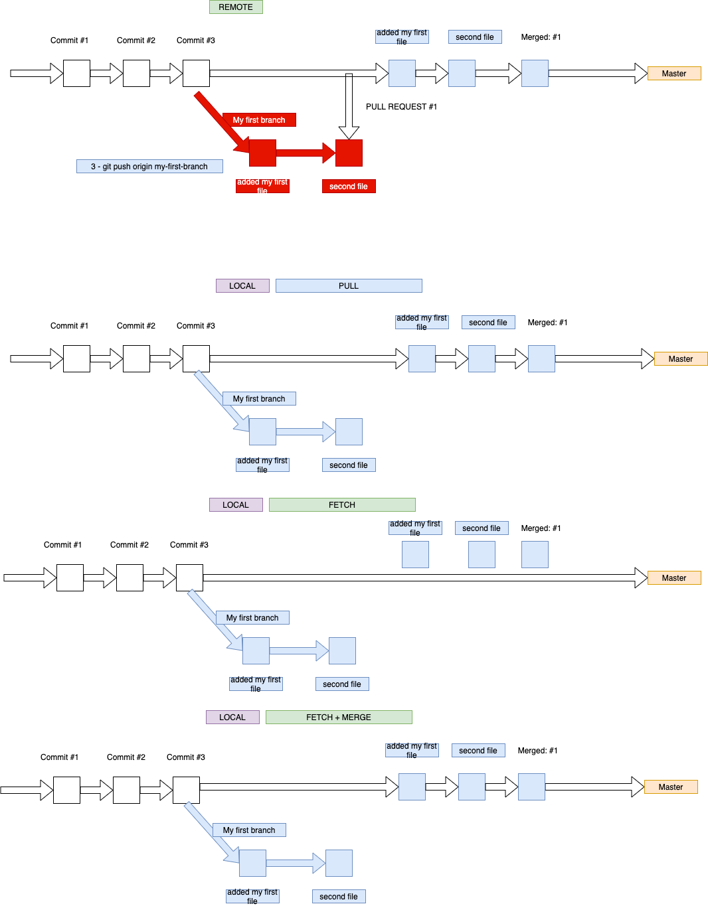

# Git - Source Code Management

Source Code Management (SCM) is one of the most important concepts for DevOps as it allows for continuous development, meaning each team member has the ability to change source code and push to the same repository. Many of them are distributed like git or mercurial, allowing users to have full local master copy.

> SCM is a practice that stores our source code in buckets on a remote server that can be accessed from our local workstations.

## What is SCM:

When developing a software application, SCM gives us the following essential features:

1. **Backup and Restore**
 - A SCM solution allows us to move between versions easily. 
 - For example, if we make a mistake in our code, we can simply go back to a working version and start work again.

2) We can **track our changes** on a project by commit. 
- This allows us to track who changed the code and what was changed. This is useful to know who does what on a project.

## Git

> Git is a free and open source **distributed version control system** designed to handle everything from small to very large projects with speed and efficiency.

* [Download and install Git](https://git-scm.com)
* After install open a terminal:
    - Mac: CMD + Space and type terminal, hit enter
    - Windows: Hit the windows key and type 'git bash', hit enter
    - Linux: Press Ctrl+Alt+T in Ubuntu, otherwise it may depend on your distro.
* Run the following command on your terminal, to run a command type it and hit enter.

```bash
git --version
```

## Set up Git

```
git config --global user.name "Your Name"
git config --global user.email "your@email.com"
```

## Using Git
* Before we start go over the following [Git tutorial](https://try.github.io/levels/1/challenges/1)


**Resources:**

[VCS and SCM for DevOps](https://www.youtube.com/watch?v=Klfjr4TF9i0)

[Basics of SCM](https://www.linuxnix.com/what-is-source-code-management-or-version-control/)

[Git CL basic](https://www.youtube.com/watch?v=HVsySz-h9r4)

## Creating a quick site (Simulated development)

* Open your terminal
* Create a new folder called **my-first-site-src**
* `mkdir my-first-site-src`
* `cd my-first-site-src`

### Git init
* This command create an empty Git repository or reinitialize an existing one
* To configure Git in this folder well run `git init`
* [Git init doc](https://git-scm.com/docs/git-init)

```bash
git init
```

* You should get the following message: `Initialized empty Git repository in your folder path`
* Now Git knows that we want to version this project and keep track of all the changes we do
* Let check git status again

```bash
git status

> On branch master
> No commits yet
> nothing to commit (create/copy files and use "git add" to track)
```

* After running **git init** we don't longer see an error
* Now we find out that we'll be using **branches**, **commits** & **add**ing files
* Git creates a hidden folder to keep track of our project
* List your folder files to see the `.git` folder

```bash
ls -la

> .
> ..
> .git
```

* Create a new file and save it with the name **index.html**
* `touch index.html`
* open it for edit (Use your favorite text editor, or just vim :) )
* `vim index.html`
* Copy the following content:

```html
<!DOCTYPE html>
<html lang="en">
  <head>
    <title>Using Git</title>
  </head>
  <body>
    <h1>Using Git</h1>
    <p>Creating my first versioned file</p>
  </body>
</html>
```
* If on vim (It will be just an empty black screen), right click and paste
- More commands [here for vim](https://coderwall.com/p/adv71w/basic-vim-commands-for-getting-started)
* Make sure to save the file again 
* to save the file on vim
	- git `ESC`, then type `:wq!` and hit enter
* Go to the terminal and check Git status

```bash
git status

> On branch master
> No commits yet
> Untracked files:
  (use "git add <file>..." to include in what will be committed)

	index.html

> nothing added to commit but untracked files present (use "git add" to track)
```

* So we still get the same messages:
  * > On branch master
  * > No commits yet
* But now we can see that we added a new file to the folder and Git knows about it
* As we haven't done anything with this file it have an `Untracked` state
* Also Git gives us some help: `use "git add <file>..." to include in what will be committed`


### Git add
* This command add file/s contents to Git index
* Lets add the index.html to Git index

```bash
git add index.html
```

* Looks like nothing happened
* Check git status again

```bash
git status

> On branch master
> No commits yet
> Changes to be committed:
  (use "git rm --cached <file>..." to unstage)

> 	new file:   index.html
```

* By executing **git add** we add the documents that we want to **commit**

### Git commit
* This command records changes to the repository
* When we commit one or many files we create a new version of our project
* To know what changed over time it's a good practice to write a descriptive message
* Now we can commit our changes running **git commit -m 'Commit message'**

```bash
git commit -m 'Added index.html file to project'

> [master (root-commit) 50400f2] Added index.html file to project
> 1 file changed, 10 insertions(+)
> create mode 100644 index.html
```

* We can see that only 1 file has changed and we added 10 new lines of code
* Run git status to check the new status

```bash
git status

> On branch master
> nothing to commit, working tree clean
```

* As we just commited our changes there's nothing new to commit

### Git log
* This command shows commit logs
* We can check our project commit history by running **git log**

```bash
git log

> commit 2a2106efbf305f23ba631055c3d73af006446466 (HEAD -> master)
> Author: Emerson Mellado <emersonmellado@gmail.com>
> Date:   Sun Jan 5 19:11:24 2020 -0800

    Added index.html file to project
```

* Once we run this command we can see all the commits that this project has
* By writing good commit messages we can know more about what changed over time
* Open the index.html file again and change the following lines:

```html
<h1>Using Git</h1>
<p>Creating my first versioned file</p>
```

To

```html
<h1>Learning and using Git</h1>
<p>Creating my commits</p>
```

* Save your file
* Check Git status

```bash
git status

> On branch master
> Changes not staged for commit:
  (use "git add <file>..." to update what will be committed)
  (use "git checkout -- <file>..." to discard changes in working directory)

	modified:   index.html

> no changes added to commit (use "git add" and/or "git commit -a")
```

* Now we can see a couple of new things going on:
  * Git shows 2 options:
    * We can add the changes we did to index.html to commit them: `(use "git add <file>..." to update what will be committed)`
    * Also we can checkout the previous index.html version and discard the changes we did: `(use "git checkout -- <file>..." to discard changes in working directory)`
  * Also now index.html is modified (`modified:   index.html`) instead than a new file

* Go ahead and add this changes
* Commit the changes and create a new version
* The commit message should be: Updated index.html content
* Check git log

```bash
git add index.html
git status
git commit -m 'Updated index.html content'
git log

commit 821860970a24df8630442ae1241c72b906c9059f (HEAD -> master)
Author: Emerson Mellado <emersonmellado@gmail.com>
Date:   Sun Jan 5 19:14:04 2020 -0800

    Updated index.html content

commit 2a2106efbf305f23ba631055c3d73af006446466
Author: Emerson Mellado <emersonmellado@gmail.com>
Date:   Sun Jan 5 19:11:24 2020 -0800

    Added index.html file to project
```

* Now we have 2 commits in our project log
* Delete index.html

```bash
rm index.html
```

* Check Git status

```bash
git status

> On branch master
> Changes not staged for commit:
  (use "git add/rm <file>..." to update what will be committed)
  (use "git checkout -- <file>..." to discard changes in working directory)

	deleted:    index.html

> no changes added to commit (use "git add" and/or "git commit -a")
```

* We can see that we deleted the file
* Git shows 2 options
  * We can remove the file from git project by running git rm
  * Or discard the changes running git checkout -- index.html
* As we don't want to delete the file execute git checkout to get the previous version

```bash
git checkout -- index.html
```

* If we run git status we'll see that the deleted index.html message is no longer there

```bash
git status

> On branch master
> nothing to commit, working tree clean
```

* Also if we list our folder files wi'll see that index.html is still there

```bash
ls -la

> .
> ..
> .git
> index.html
```

## git rm
* To delete one or many files from a project we can run **git rm**
* This command remove files from the working tree and from the index
* Delete index.html from the project

```bahs
git rm index.html

> rm 'index.html'
```

* Check Git status

```bash
git status

> On branch master
> Changes to be committed:
  (use "git reset HEAD <file>..." to unstage)

	deleted:    index.html
```

* Git rm works like git add but instead of adding the file we'll delete it from the project
* Now we need to commit our change and delete the index.html file

```bash
git commit -m 'Deleted index.html'

> [master a03ee32] Deleted index.html
>  1 file changed, 10 deletions(-)
>  delete mode 100644 index.html
```

* Now check Git status

```bash
git status

> On branch master
> nothing to commit, working tree clean
```

* List all the folder files

```bash
ls -la

> .
> ..
> .git
```

* Finaly check git log

```bash
git log

commit 6fc31793472ef283c16c673c4ec62d7b348358b2 (HEAD -> master)
Author: Emerson Mellado <emersonmellado@gmail.com>
Date:   Sun Jan 5 19:16:28 2020 -0800

    Deleted index.html

commit 821860970a24df8630442ae1241c72b906c9059f
Author: Emerson Mellado <emersonmellado@gmail.com>
Date:   Sun Jan 5 19:14:04 2020 -0800

    Updated index.html content

commit 2a2106efbf305f23ba631055c3d73af006446466
Author: Emerson Mellado <emersonmellado@gmail.com>
Date:   Sun Jan 5 19:11:24 2020 -0800

    Added index.html file to project
```

* We can see that we added a index.html file
* Then we updated the file contents
* Finally we deleted it
* Now we have an empty project again but with git history

#### Create a local and remote repo
* Navigate to your home folder `cd ~`
* Create a new folder called **devopsbc**
* Navigate into it `cd devopsbc`
* Init the git repo `git init`
* Create a **hello-world.py** file

```bash
git init
touch hello-world.py
```
* Add a Hello World print message to it

```bash
print ("Hello DevOps World")
```

```bash
git status

> On branch master
> Untracked files:
>   (use "git add <file>..." to include in what will be committed)

>	hello-world.py
```

* Git will show us the file that we added (hello-world.py)
* Add the file to be commited

```bash
git add .
```

* Show Git status

```
git status

> On branch master
> Changes to be committed:
>   (use "git reset HEAD <file>..." to unstage)

>	new file:   hello-world.py
```

* Commit the files

```bash
git commit -m 'Added hello-world'
```

* By doing this we are versioning our first python script


## GitHub
* Go to [github.com](https://github.com)
* Create a new GitHub account
* Create a `new repository` (click on the plus sign at the right top corner of the GitHub website) with the name `devopsbc`
* Once you create a new repository GitHub will show you all the possible options that we have
* As we already created a project we can run the following commands
* Copy the URL generated with the **.git** in the end

### Git remote

```bash
git remote add origin https://github.com/YOUR_GITHUB_NAME/devopsbc.git
```

* By executing this command we're configuring a remote git server (GitHub)
* We run the **git remote** commands to work with a remote server
* Then we are adding a new server so we have **add**
* Origin is the default name by convention for our main source
* So with this command we let git know that we want to add a remote server with the url https://github.com/YOUR_GITHUB_NAME/devopsbc.git that we'll call origin
* We can list the project remote servers

```bash
git remote

> origin
```

* That didn't help :(
* Do it again but now add **-v**

```bash
git remote -v

origin	https://github.com/YOUR_GITHUB_NAME/devopsbc.git (fetch)
origin	https://github.com/YOUR_GITHUB_NAME/devopsbc.git (push)
```

* Now I can see that I have **fetch** & **push** permission
* We use **fetch** to get changes from the server
* We use **push** to push our changes to the server
* Push your local code changes to the GitHub server

```bash
git push origin master

> Counting objects: 12, done.
> Delta compression using up to 8 threads.
> Compressing objects: 100% (8/8), done.
> Writing objects: 100% (12/12), 1.20 KiB | 1.20 MiB/s, done.
> Total 12 (delta 1), reused 0 (delta 0)
> remote: Resolving deltas: 100% (1/1), done.
To github.com:YOUR_GITHUB_NAME/devopsbc.git
 * [new branch]      master -> master
```

* If we refresh our GitHub page we'll see that our file is now part of the GitHub repository
* Click on the file to see its contents
* Now go back to the project home page
* Click on commits
* Now you can see your commits history in a web page
* To setup our GitHub repository it's nice to add a README.md file as initial project file
* Create a README.md file at the root level

```bash
/
|- hello-world.py
|- README.md
```

* Add the following content to README.md

```
# DevOps BC

This project is to learn DevOps

1. [Hello world](hello-world.py)
```

* Check Git status

```bash
git status

> On branch master
> Untracked files:
  (use "git add <file>..." to include in what will be committed)

	README.md

> nothing added to commit but untracked files present (use "git add" to track)
```

* Now add the README.md file to git

```bash
git add .
```

* By using a dot `.` we let Git knows that we want to add all the files that we changed
* Check Git status

```bash
git status

> On branch master
> Changes to be committed:
  (use "git reset HEAD <file>..." to unstage)

>	new file:   README.md
```

* Looks like README.md has been `staged` so we can commit it
* So we just need to commit

```bash
git commit -m 'Added README.md'

> [master 98db347] Added README.md
> 1 file changed, 5 insertions(+)
> create mode 100644 README.md
```

* Check Git log

```bash
git log
```

* Look at the last commint and the the previous one
* The last commit shows (HEAD -> master)
* The previous one (origin/master)
* So it looks like our local project is ahead 1 commit from origin (our remote server)
* Check on GitHub commits to see if you have the latest commit
* As we don't have it, we need to push it

```bash
git push origin master

> Counting objects: 3, done.
> Delta compression using up to 8 threads.
> Compressing objects: 100% (3/3), done.
> Writing objects: 100% (3/3), 384 bytes | 384.00 KiB/s, done.
> Total 3 (delta 0), reused 0 (delta 0)
> To github.com:YOUR_GITHUB_NAME/devopsbc.git
>   c74bf4d..98db347  master -> master
```

* Now check your commits on GitHub
* Also take a look at the project home page
* As you can see we can add a home page for our projects
* To learn more about GitHub Markdown read [GitHub Mastering Markdown guide](https://guides.github.com/features/mastering-markdown/)

## git clone
* This command clone a repository into a new directory
* You can either manually create the folder or pass the new folder name as a **parameter**
* Return one level from the current folder with **cd ..**

And then let's clone
```bash
git clone https://github.com/YOUR_GITHUB_NAME/devopsbc.git test_cloning
```

* List the files

```bash
ls -la

> .
> ..
> devopsbc
> test_cloning
```

* Change directory to `test_cloning`

```bash
cd test_cloning
```

* Check Git status

```
git status

> On branch master
> Your branch is up to date with 'origin/master'.

> nothing to commit, working tree clean
```

* Nothing to commit as we just got a fresh copy
* Check the project log

```bash
git log
```

* You'll see the same commits as we did early as it's the same project
* By cloning the project some other team member can work on this project too
* Now update the README.md file (open it using vim)

```
  2. [Python exercises](python)
```

* Save the file
* Add the new change

```bash
git add .
```

* Now commit the changes

```bash
git commit -m 'Added python exercises link to README.md'

> [master 1678975] Added python exercises link to README.md
> 1 file changed, 2 insertions(+), 1 deletion(-)
```

* So at this moment we have 2 folders that have the same project
* The test_cloning one has one more commit that the initial `devopsbc` one
* Push your code to the GitHub server

```bash
git push origin master

> Counting objects: 3, done.
> Delta compression using up to 8 threads.
> Compressing objects: 100% (3/3), done.
> Writing objects: 100% (3/3), 354 bytes | 354.00 KiB/s, done.
> Total 3 (delta 1), reused 0 (delta 0)
> remote: Resolving deltas: 100% (1/1), completed with 1 local object.
> To github.com:YOUR_GITHUB_NAME/devopsbc.git
>    98db347..1678975  master -> master
```

* Now we have the changes in the test_cloning or devopsbc folder and on the GitHub server
* We still need to update our initial `devopsbc`
* Lets change directory to the previous folder

```bash
cd .. (to leave the test_cloning folder)
cd devopsbc (to enter the devopsbc folder)
git status

> On branch master
> nothing to commit, working tree clean
```

* Check git log

```
git log
```

* Notice that we're missing the last commit
* To sync again with the remote server we can fetch the latest changes

```bash
git fetch origin master

> remote: Counting objects: 3, done.
> remote: Compressing objects: 100% (2/2), done.
> remote: Total 3 (delta 1), reused 3 (delta 1), pack-reused 0
> Unpacking objects: 100% (3/3), done.
> From github.com:YOUR_GITHUB_NAME/devopsbc
>  * branch            master     -> FETCH_HEAD
>    98db347..1678975  master     -> origin/master
> Updating 98db347..1678975
> Fast-forward
>  README.md | 3 ++-
```

* Git got all the changes from the server
* Now check the log again

```bash
git log
```

* Now our local folder is in sync with the server
* Create a **python** folder (`mkdir python`) at the root level
* Add this folder to git: `git add .`
* Commit your changes `git commit -m "Adding python folder"`
* Push your changes to the origin server `git push origin master`
* Now you'll be able to add your python exercises into this **python** folder and git will version them
* Happy coding and I hope you like using Git and GitHub!
* Checkout the great [Octocats](https://octodex.github.com)

## Final notes
* We'll work on our local project by creating and updating files
* Once we are happy with our code we'll have to add all the files to `stage` (`git add .` or `git add filename`)
* Then we'll need to commit (`git commit -m 'Commit Message'`)
* If we have a GitHub project and we want to share/update it we'll have to run `git push origin master`
* If someone else updates our remote server we'll have to run `git fetch origin master` to get the latest changes
* We'll do this workflow many times so get used to it and remember to check `git status` to know what's going on

## Branches & PR & Fork

### General git flow


### Pull vs Fetch


## Git & GitHub Assets
* [Git Reference](https://git-scm.com/docs)
* [Git Free book](https://git-scm.com/book/en/v2)
* [GitHub Git cheat sheet](https://github.github.com/training-kit/downloads/github-git-cheat-sheet.pdf)
* [Visual cheat sheet](http://ndpsoftware.com/git-cheatsheet.html#loc=;)
* [GitHub](https://github.com)
* [GitHub Hello World](https://guides.github.com/activities/hello-world)
* [GitHub Guides](https://www.youtube.com/githubguides)

[<- Go Back](README.md)
