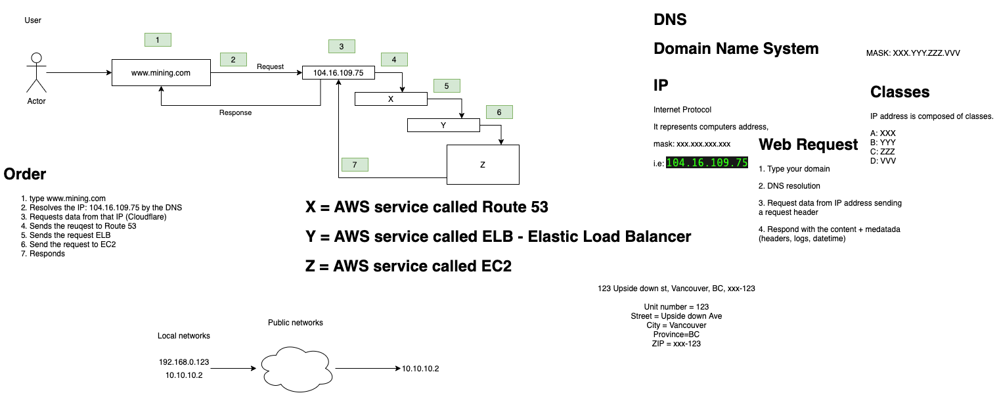
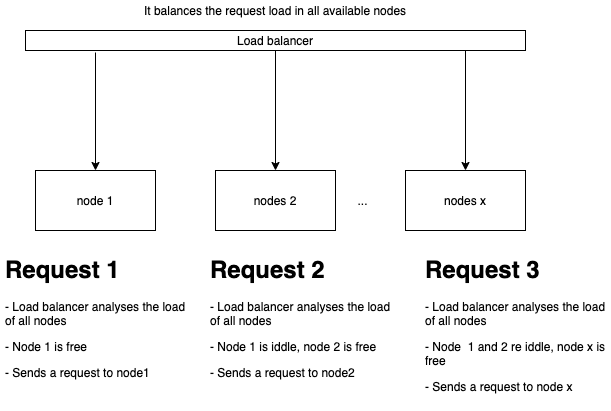

# Network

We need to get a grasp of how the Web works, it does not need to be in high detail right now, but here are some resources to help you move forward:

### Getting started
- [How the web works](https://developer.mozilla.org/en-US/docs/Learn/Getting_started_with_the_web/How_the_Web_works)

### Mining.com infrastructure example
Web Request Example:
- 

Load balancer overview
- 

# Practice

- [Elastic Beanstalk tutorial](https://docs.aws.amazon.com/elasticbeanstalk/latest/dg/create-deploy-python-flask.html)

You can use [AWS free tier](https://aws.amazon.com/free/?all-free-tier.sort-by=item.additionalFields.SortRank&all-free-tier.sort-order=asc) to create your own first resources online:
